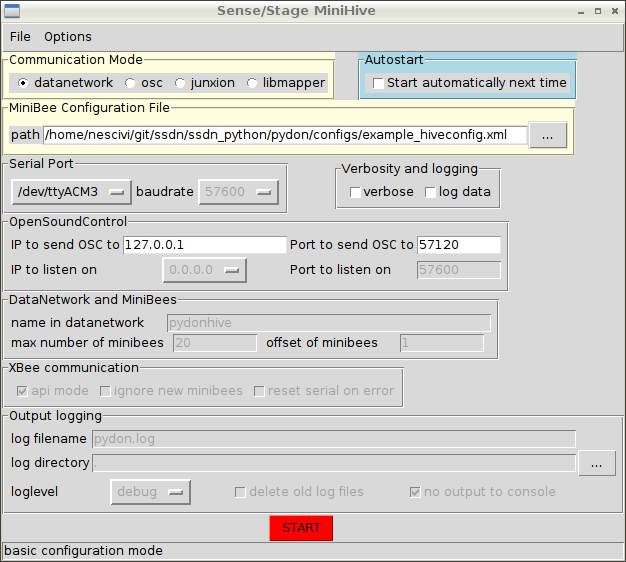

$order=1
$title=Using the python software

After you have installed the Python software, you can use the python program to interface with your Sense/Stage MiniBee network. There are two options for usage, through a GUI, or through a command-line script.

###GUI version

The GUI can be started:

- On Linux and OSX from the commandline with ```pydongui.py```
- On Windows you can start it by double clicking on the file ```start_pydon.bat```

A window will show that looks like this:



The window provides a number of settings, categorised by topic.

The most important ones are:

- **Communication mode:** this defines which kind of OSC communication you will use to communicate to other programs. Choices are:
    * *osc* – Using a simple OSC-interface to communicate the data to one client.
    * *junxion* – Using a tailored OSC-interface to communicate with STEIM’s Junxion software.
    * *datanetwork* – Using the SenseWorld DataNetwork to transfer the data to multiple clients using the DataNetwork framework.
    * *libmapper* – Using the libmapper interface to transfer the data to multiple clients using the libmapper framework.

    As you switch between the different options, settings that are relevant to these options will become enabled.
    
- **MiniBee configuration file:** this is an XML file containing information on what kind of sensors are attached to your minibees. Examples are provided in the download of the pydon package. For documentation on the format, read this page. You can browse to the appropriate configuration file using the […] button.
    
- **Serial port:** here you need to select the serial port to use. The dropdown menu provides all ports that are found on your computer.

- **OSC communication:** here you can define the target host and port, i.e. where the OSC messages will be sent.

- **Verbosity:** these are some options to provide more output as the program is running; they are mainly meant for debugging, or recording data in a raw format. For a performance situation you would leave these options off.

- **Autostart:** this is an option to automatically start with the last used settings, the next time the program is started. This allows for a quick automatic startup. 

In the [Options] menu, you can select the [Advanced] mode, which will allow tweaking all settings. In most normal use cases you will not need to change the advanced settings.

By clicking [START] you start the communication with the Sense/Stage MiniBees and the OSC communication. At this point also the settings are stored to a file named ```pydondefaults.ini```. The next time you start pydongui.py it will read the settings from this file and use these as defaults. The program will look for the last used settings in the directory from which you start ```pydongui.py```.

### Command line interface

Alternatively you can use the command line interface:

```$ pydoncli.py```

Options are taken from the file ```pydondefaults.ini``` that should be in the same folder as from where you call the script.

If you provide additional command line parameters, it will start with default arguments for all parameters not specified on the command line, and use the command line parameters for the other ones (and store these as new defaults).

To see which parameters are available:

    $ pydoncli.py -h

this will print the help:

    Usage: pydoncli.py [options]

    MetaPydonHive - Create a client to communicate with the minibee network.

    Options:
      -h, --help            show this help message and exit
      -P PROGRAM, --program=PROGRAM
                        Which program/infrastructure do you want to use?
                        options: datanetwork, osc, libmapper, junxion
      -s SERIAL, --serial=SERIAL
                        the serial port [default:/dev/ttyUSB0]
      -a APIMODE, --apimode=APIMODE
                        use API mode for communication with the minibees
                        [default:False]
      -v VERBOSE, --verbose=VERBOSE
                        verbose printing [default:False]
      -u IGNORE, --ignore-unknown=IGNORE
                        ignore unknown minibees [default:False]
      -x XBEEERROR, --check-for-xbee-error=XBEEERROR
                        check whether xbee-error occurred [default:False]
      --auto=AUTOSTART      autostart [default:False]
      -l LOGDATA, --logdata=LOGDATA
                        log data to file [default:False]
      -c CONFIG, --config=CONFIG
                        the name of the configuration file for the minibees
                        [default:../configs/example_hiveconfig.xml]
      -n NAME, --name=NAME  the name of the client in the datanetwork
                        [default:pydonhive] (needed for datanetwork or
                        libmapper)
      -b BAUDRATE, --baudrate=BAUDRATE
                        the serial port [default:57600]
      -m MINIBEES, --nr_of_minibees=MINIBEES
                        the number of minibees in the network [default:20]
      -o MBOFFSET, --minibee_offset=MBOFFSET
                        the offset of the number range for the minibees in the
                        network [default:1]
      -d HOST, --host_ip=HOST
                        the ip address of the datanetwork host or osc/junxion
                        receiver [default:127.0.0.1]
      -t HPORT, --host_port=HPORT
                        the port on which the application that has to receive
                        the OSC messages will listen [default:57120] (needed
                        for osc or junxion or default for datanetwork)
      -i IP, --ip=IP        the ip on which the client will listen
                        [default:0.0.0.0]
      -p PORT, --port=PORT  the port on which the client will listen
                        [default:57600]
      -N LOGNAME, --logname=LOGNAME
                        log name (default pydon.log)
      -V LOGLEVEL, --loglevel=LOGLEVEL
                        logging level (debug, info, error)
      -L LOGDIR, --logdir=LOGDIR
                        log DIRECTORY (default ./)
      -Q, --quiet           do not log to console
      -C, --clean           remove old log file

To start it you would do for example:


    $ pydoncli.py -P osc -c configs/example_hiveconfig.xml -s /dev/ttyUSB0

```/dev/ttyUSB0``` is the address of your serial port, it will be different on a mac (something like: ```/dev/tty-ASSFADF0002332```):

    $ pydoncli.py -P osc -c configs/example_hiveconfig.xml -s /dev/tty-ASSFADF0002332

If you want to send the data to another machine:

    $ pydoncli.py -c nameofconfigfile.xml -d 192.168.0.7

where ```192.168.0.7``` is the IP address of the other machine.

If you need to figure out what is going on, there is a verbosity switch, which will print more output:

    $ pydoncli.py -c example_hiveconfig.xml -s /dev/ttyUSB0 -v True
